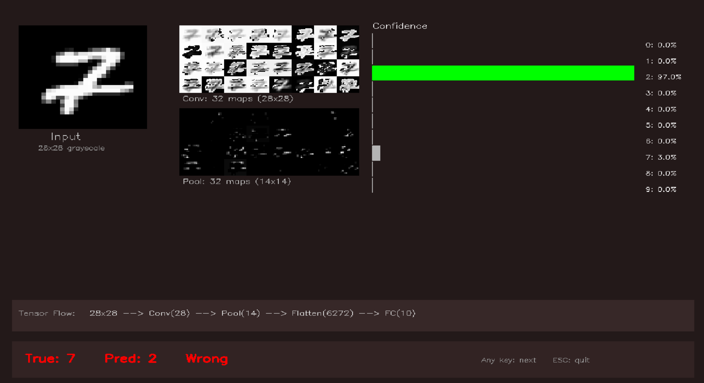
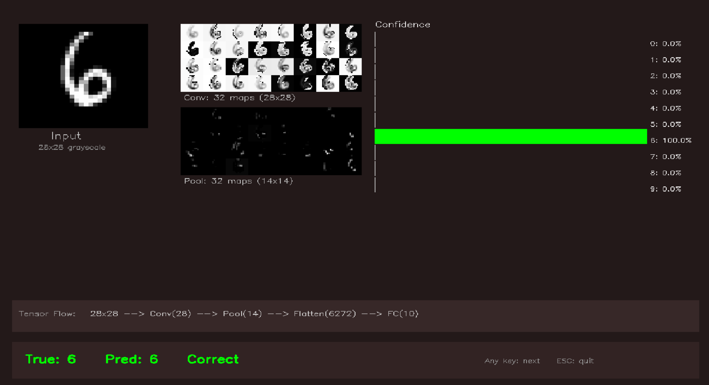

# MNIST 手写数字识别 / MNIST Handwritten Digit Recognition

基于 PyTorch 的 MNIST 手写数字识别项目 / PyTorch-based MNIST handwritten digit recognition project.

## 项目结构 / Project Structure

```
HandWritingNumber/
├── model.py            # CNN 模型定义 / CNN model definition
├── minist_train.py     # 训练脚本 / Training script
├── mnist_predict.py    # 预测/展示脚本 / Prediction/display script
├── nn_predict_demo.py  # 神经网络预测过程演示 / NN prediction process demo
├── mnist_model.pkl     # 训练好的模型权重 / Trained model weights
├── data/               # MNIST 数据集目录 / MNIST dataset directory
└── README.md
```

## 演示截图 / Demo Screenshots

| 预测展示 / Prediction Display | 过程演示 / Process Demo |
|:---:|:---:|
|  |  |

## 环境要求 / Requirements

- Python 3.8+
- PyTorch (CUDA 支持 / CUDA support)
- OpenCV (用于预测结果可视化 / for visualization)

## 模型架构 / Model Architecture

- **卷积层 / Conv Layer**: Conv2d(1, 32, kernel_size=5, padding=2) → BatchNorm → ReLU → MaxPool
- **全连接层 / FC Layer**: Linear(14×14×32, 10)
- **输出 / Output**: 10 个类别 (0-9) / 10 classes (0-9)

## 训练 / Training

```bash
python minist_train.py
```

| 参数 / Parameter | 值 / Value |
|---|---|
| 训练集 / Training set | 60,000 张图片 / images |
| 测试集 / Test set | 10,000 张图片 / images |
| Batch Size | 64 |
| Epochs | 10 |
| 优化器 / Optimizer | Adam (lr=0.01) |
| 损失函数 / Loss | CrossEntropyLoss |

## 预测 / Prediction

```bash
python mnist_predict.py
```

- 按任意键查看下一张图片 / Press any key to view next image
- 按 ESC 退出 / Press ESC to exit
- 绿色边框 = 正确，红色边框 = 错误 / Green border = correct, Red border = wrong

## 神经网络预测过程演示 / Neural Network Prediction Demo

```bash
python nn_predict_demo.py
```

可视化展示神经网络预测的内部工作过程 / Visualizes the internal working process of neural network prediction:

| 区域 / Area | 内容 / Content |
|---|---|
| 左列 / Left | 原始输入图片 (28×28 灰度图) / Original input image (28×28 grayscale) |
| 中列 / Middle | 卷积层特征图 (32 张 28×28) 和池化层特征图 (32 张 14×14) / Conv feature maps & Pool feature maps |
| 右列 / Right | 10 个数字的 Softmax 置信度分布 / Softmax confidence distribution for 10 digits |
| 底部 / Bottom | 张量形状变化流程 / Tensor shape transformation flow |

- 按任意键查看下一张图片，按 ESC 退出 / Press any key for next image, ESC to quit